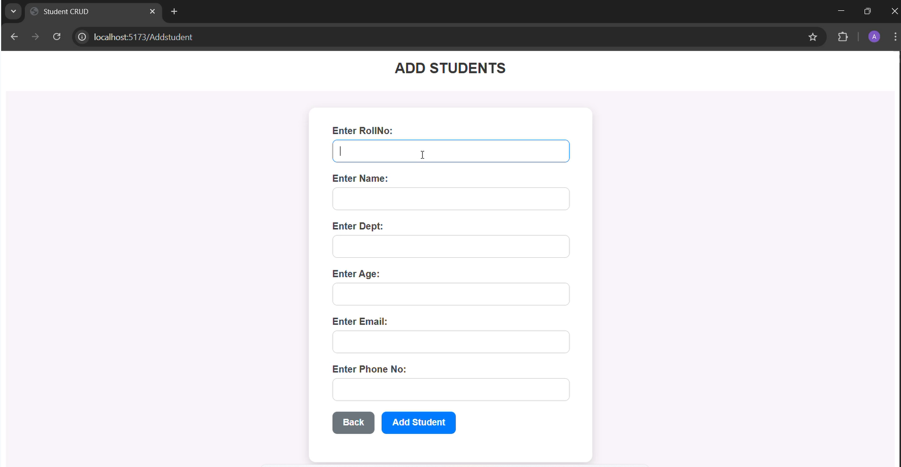
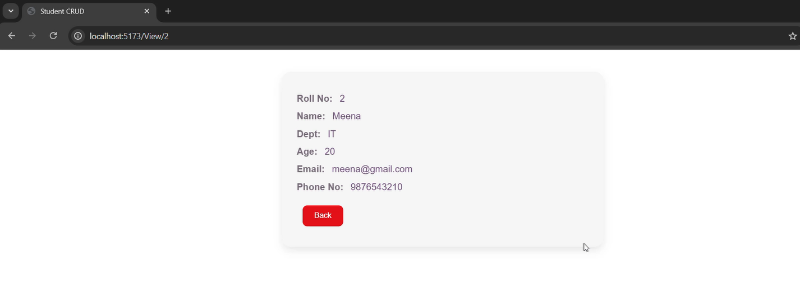
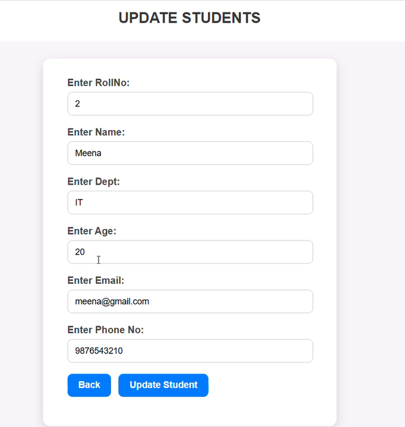
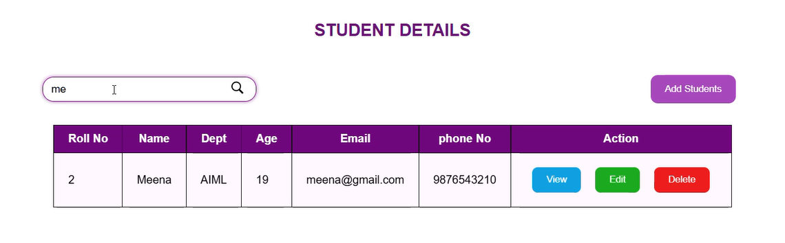

# Student-CRUD

A React + Vite project with JSON Server for managing students.

## How to Run

1. Clone the repo:
   ```bash
   git clone https://github.com/Ashiya-BIT045/Student-CRUD.git
   cd Student-CRUD
   
2.Install dependencies:
   npm install
   
3.Start JSON Server(in a new terminal):
   npx json-server --watch db.json --port 5000
This will run the backend API on http://localhost:5000.
   
4.Start Vite dev server:
   npm run dev
   
5.Open in browser:
  http://localhost:5173/

## 📸 Screenshots

### Dashboard Page


### Add student Page


### View Page


### Update Page


### Searching



# React + Vite

This template provides a minimal setup to get React working in Vite with HMR and some ESLint rules.

Currently, two official plugins are available:

- [@vitejs/plugin-react](https://github.com/vitejs/vite-plugin-react/blob/main/packages/plugin-react) uses [Babel](https://babeljs.io/) for Fast Refresh
- [@vitejs/plugin-react-swc](https://github.com/vitejs/vite-plugin-react/blob/main/packages/plugin-react-swc) uses [SWC](https://swc.rs/) for Fast Refresh

## Expanding the ESLint configuration

If you are developing a production application, we recommend using TypeScript with type-aware lint rules enabled. Check out the [TS template](https://github.com/vitejs/vite/tree/main/packages/create-vite/template-react-ts) for information on how to integrate TypeScript and [`typescript-eslint`](https://typescript-eslint.io) in your project.
